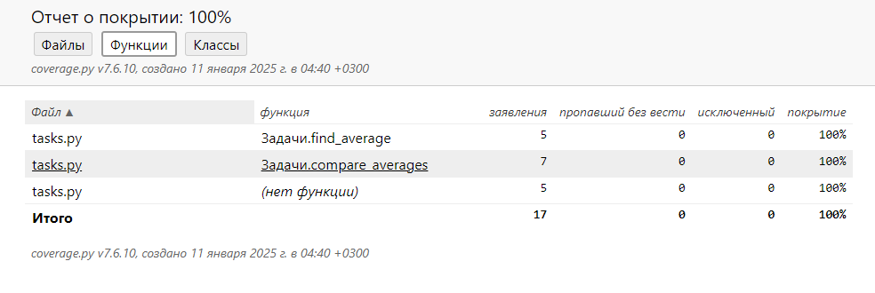
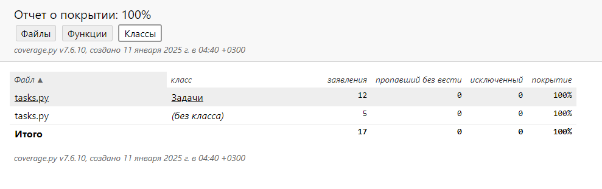
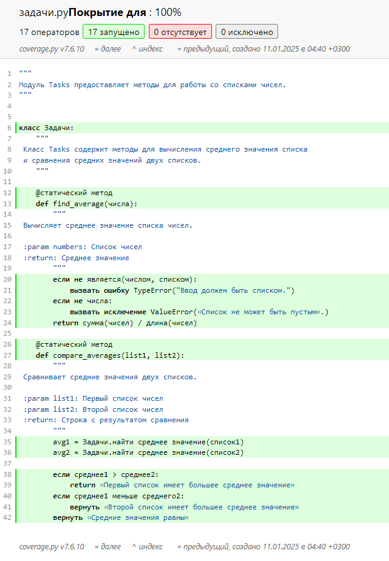

**Наталия Бугрова**
-
# Объяснение того, какие сценарии покрыты тестами и почему выбраны именно эти сценарии.
**Тесты для функции find_average:**
-

*Корректные случаи:*
-
Тестирование функции с обычным списком чисел: [10, 20, 30, 40, 50] и [5]. Это стандартные случаи использования функции, которые показывают, что она правильно вычисляет среднее значение.
-
*Пустой список:*
-
Проверка на то, что функция выбрасывает ошибку (ValueError), если список пуст. Это важно, потому что деление на ноль вызовет ошибку, и программа должна корректно обработать такой случай.
-
*Неверный тип данных:*
-
Проверка, что функция выбрасывает ошибку (TypeError), если на вход подаётся не список. Это защищает функцию от некорректного ввода.
-
*Отрицательные числа:*
-
Проверяется корректная работа функции с отрицательными числами, например, [-10, -20, -30]. Это подтверждает, что программа учитывает знаки чисел.
-
*Дробные числа:*
-
Тестирование функции с дробными числами [1.5, 2.5, 3.5]. Это помогает убедиться, что функция корректно работает с числами с плавающей запятой.
-
**Тесты для функции compare_averages:**
-
*Первый список больше:*
-
Сценарий, где среднее значение первого списка больше, чем у второго: [5, 10, 15] и [1, 2, 3]. Функция должна вернуть правильный результат.
-
*Второй список больше:*
-
Сценарий, где среднее значение второго списка больше: [1, 2, 3] и [5, 10, 15].
-
*Средние значения равны:*
-
Проверка случая, когда средние значения списков равны: [1, 2, 3] и [1, 2, 3].
-
*Пустой список:*
-
Проверка на то, что функция выбрасывает ошибку (ValueError), если один из списков пуст. Это необходимо для защиты программы от некорректного ввода.
-
*Большие числа:*
-
Тестирование функции с большими числами, такими как [1e9, 2e9, 3e9]. Это помогает убедиться, что функция работает корректно с большими значениями.
-
*Отрицательные числа:*
-
Проверка работы функции с отрицательными числами, например, [-5, -10, -15] и [-1, -2, -3].
-
*Списки с одним элементом:*
-
Проверка функции на корректность работы, если в списке только один элемент: [42] и [1, 2, 3].
-
*Оба списка пусты:*
-
Проверка, что функция выбрасывает ошибку (ValueError), если оба списка пусты. Это граничный случай, который важно учитывать.
-
*Некорректный ввод:*
-
Проверка того, что функция выбрасывает ошибку (TypeError), если вместо списка переданы неверные данные, например, строка "invalid".
-

*Я выбрала вышеуказанные сценарии, потому что они позволяют проверить важные аспекты работы программы. В первую очередь, нужно было убедиться, что функции справляются со своей основной задачей - корректно вычисляют средние значения и сравнивают их. Это основа программы, и без этого она просто не имеет смысла.*
-
*Дальше я подумала о том, что пользователи могут вводить не только «хорошие» данные, но и совсем неожиданные, например, пустые списки или строки вместо списка. Такие ошибки могли бы привести к сбоям, поэтому я добавила тесты на граничные случаи. Это помогает убедиться, что программа реагирует правильно - не ломается, а выдаёт понятные ошибки.*
-
*Кроме того, я проверила сценарии с отрицательными и дробными числами, потому что такие данные встречаются в реальной жизни, и важно, чтобы программа могла с ними работать. Например, в случае с отрицательными числами, можно было бы случайно пропустить минус в коде, и результаты уже были бы неправильными.*
-
*Сравнение средних - это отдельная важная часть программы. Здесь я проверила ситуации: когда первый список больше, второй больше и когда они равны. Тут я хотела убедиться, что программа даёт правильные ответы.*
-
*Добавила немного сложных случаев, чтобы проверить программу на устойчивость: большие числа, списки с одним элементом, совсем пустые списки, чтобы убедиться, что код будет работать стабильно при таких параметрах.*
-

**Отчет pylint:**
-

**Отчет о покрытии:**
-

